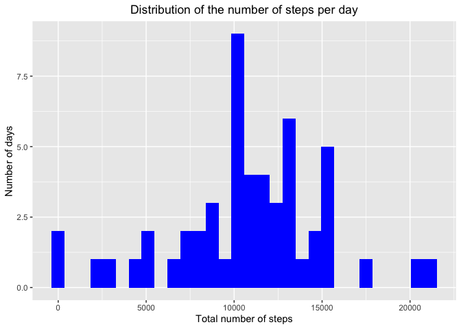
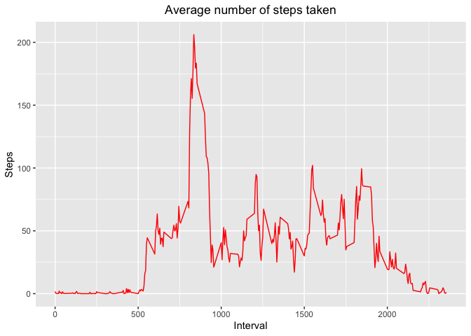
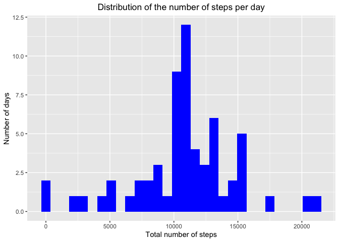
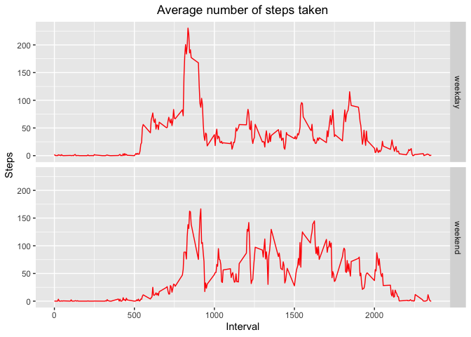

## Loading and preprocessing the data

Using the `readr` package, it is possible to read data directly from the compressed file without unzipping it.


```r
library(readr)
activity <- read_csv("activity.zip")
```


## What is mean total number of steps taken per day?
Taking advantage of the `dplyr` package, observation can be grouped by date, in order
to easily calculate the total number of steps per day, which is then shown in an histogram.

```r
library(dplyr)
stepsPerDay <- activity %>% group_by(date) %>% summarize(steps = sum(steps))
library(ggplot2)
qplot(steps, data = stepsPerDay, geom = "histogram",  fill = I("blue"), xlab = "Total number of steps", ylab = "Number of days", main = "Distribution of the number of steps per day") + theme(plot.title = element_text(hjust = 0.5))
```

```
## Warning: Removed 8 rows containing non-finite values (stat_bin).
```

<!-- -->

Now the mean and median can be simply calculated as

```r
mean(stepsPerDay$steps, na.rm = TRUE)
```

```
## [1] 10766.19
```

```r
median(stepsPerDay$steps, na.rm = TRUE)
```

```
## [1] 10765
```

## What is the average daily activity pattern?

To find the daily activity pattern, group the observations this time by the interval. 

```r
averageStepsPerInterval <- activity %>% group_by(interval) %>% summarize(steps = mean(steps, na.rm = TRUE))
qplot(interval, steps, data = averageStepsPerInterval, geom = "line", colour = I("red"), xlab = "Interval", ylab = "Steps", main = "Average number of steps taken") + theme(plot.title = element_text(hjust = 0.5))
```

<!-- -->

The interval containing the maximum average number of steps can be determined as follows.

```r
averageStepsPerInterval[which.max(averageStepsPerInterval$steps),"interval"]
```

```
## # A tibble: 1 x 1
##   interval
##      <dbl>
## 1      835
```

## Imputing missing values

The total number of rows with missing values for the number of steps can be computed as follows.

```r
nrow(activity[is.na(activity$steps),])
```

```
## [1] 2304
```

`imputedActivity` is a copy of the original dataset with each missing value replaced by the average value for that 5-minute interval.

```r
imputedActivity <- activity;

for (i in 1 : nrow(activity)) {
	imputedActivity[i,"steps"] <-
		if_else(is.na(activity[i,"steps"]), 
				as.numeric(averageStepsPerInterval[averageStepsPerInterval$interval == as.numeric(activity[i,"interval"]),"steps"]), 
				as.numeric(activity[i,"steps"]))
}
```

With the same code executed previously, it is possible to evaluate the effect of imputation on the distribution, mean and median of the number of steps per day.

```r
stepsPerDay <- imputedActivity %>% group_by(date) %>% summarize(steps = sum(steps))

qplot(steps, data = stepsPerDay, geom = "histogram",  fill = I("blue"), xlab = "Total number of steps", ylab = "Number of days", main = "Distribution of the number of steps per day") + theme(plot.title = element_text(hjust = 0.5))
```

<!-- -->

```r
mean(stepsPerDay$steps, na.rm = TRUE)
```

```
## [1] 10766.19
```

```r
median(stepsPerDay$steps, na.rm = TRUE)
```

```
## [1] 10766.19
```
## Are there differences in activity patterns between weekdays and weekends?
First, it is necessary to add a variable to determine whether the day is a weekday or not.

```r
Sys.setlocale("LC_TIME", "en_US");
imputedActivity$inWeek <- as.factor(if_else(weekdays(imputedActivity$date) %in% c("Saturday", "Sunday"), "weekend", "weekday"))
```
Now the plot can be created after grouping observations by interval, and weekday/weekend variable.

```r
averageStepsPerInterval <- imputedActivity %>% group_by(interval, inWeek) %>% summarize(steps = mean(steps, na.rm = TRUE))
qplot(interval, steps, data = averageStepsPerInterval, geom = "line", colour = I("red"), facets = inWeek ~ ., xlab = "Interval", ylab = "Steps", main = "Average number of steps taken") + theme(plot.title = element_text(hjust = 0.5))
```

<!-- -->

